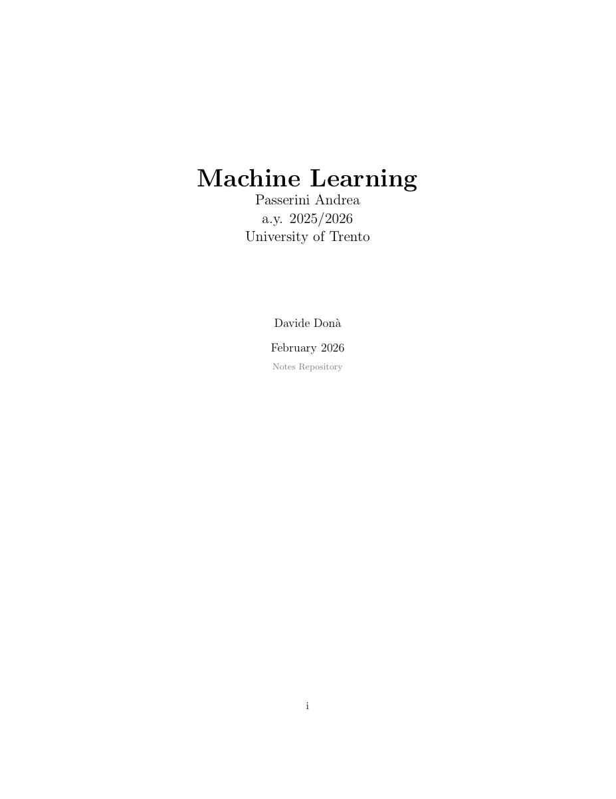

# Machine Learning Notes

A detailed collection of LaTeX-based lecture notes for the Machine Learning course at the University of Trento, academic year 2025/2026, instructed by Prof. Andrea Passerini.

The notes cover fundamental and advanced topics in Machine Learning.

    
     
    <a href="notes.pdf" style="display: block; margin-top: 10px; font-size: 15px; font-weight: bold; color: #007acc;">
    Download the PDF notes</a>

---

## Topics Covered

| Section | Description |
|---|---|
| **Evaluation** | Performance measures for classifiers: accuracy, precision, recall, F-measure, confusion matrices (binary & multi-class), K-Fold cross-validation |
| **Decision Trees** | Tree-based classifiers, splitting criteria, pruning, Random Forests |
| **K-Nearest Neighbours** | Instance-based learning, distance metrics|
| **Parameter Estimation** | MLE, MAP, Bayesian estimation, i.i.d. assumptions |
| **Bayesian Networks** | DAG structure, independence maps, d-separation, factorization |
| **Learning Bayesian Networks** | Parameter learning, structure learning from data |
| **Naive Bayes** | Parameter learning, conditional independence assumption |
| **Linear Discriminant Functions** | Discriminant vs Generative models, Linear classifiers, decision boundaries |
| **Perceptron** | Single-layer perceptrons, learning algorithm |
| **Support Vector Machines** | Maximum margin classifiers, soft margin, dual formulation |
| **Kernel Machines** | Feature maps, Kernel trick, valid kernels, Gram matrix, Kernel on graphs |
| **Neural Networks** | Multiple Layer Perceptrons, backpropagation, activation functions, regularization, other modern architectures |
| **Unsupervised Learning** | Clustering, K-Means, EM-Clustering, Hierarchical Clustering, choosing n. of clusters |
| **Unsupervised Learning** | Clustering, K-Means, EM-Clustering, Hierarchical Clustering, choosing n. of clusters |
| **Reinforcement Learning** | Markov Decision Processes, Utilities, Value Iteration, Policy Iteration, Unknown MDPs, ADP, TD Learning, SARSA, Q-Learning |

---

##  Contributing

Contributions are welcome! Here's how you can help:

###  Issues
- Found a **typo**, a **wrong formula**, or a **missing topic**? [Open an issue](../../issues/new).
- Please include the **section name** and **page number** (if applicable).

###  Pull Requests
1. **Fork** this repository.
2. Create a new branch: `git checkout -b fix/your-description`.
3. Make your changes (edit the `.tex` files under `sections/`).
4. Make sure the project **compiles without errors**: `latexmk -pdf main.tex`.
5. **Commit** with a descriptive message and **push** your branch.
6. Open a **Pull Request** against `main`.

---

## License

This project is intended for educational purposes. Feel free to use and share the notes with proper attribution.